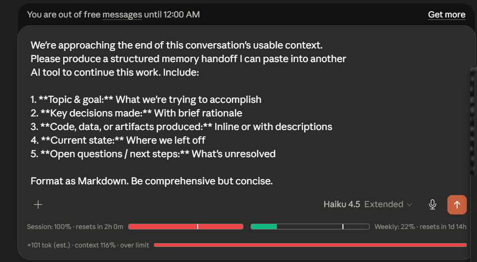

# Claude Token Counter

A browser extension for [claude.ai](https://claude.ai) that shows token usage with traffic-light color warnings, a live pre-send token preview, and a context-handoff modal at 85%.

> **Forked from [she-llac/claude-counter](https://github.com/she-llac/claude-counter)** (MIT). All upstream features (token count, cache timer, session + weekly usage bars) are preserved. This fork adds the warning system, preview, and handoff modal described below.


## What this fork adds

| Feature | Where you see it |
|---|---|
| **Traffic-light color system** — green (<50%), yellow (50–70%), red (≥70%) | On the main context bar, session bar, weekly bar, and preview bar |
| **Pre-send token preview** — live estimate of `+N tok · current% → projected%` as you type or paste | A new line below the message input |
| **85% handoff modal** — Claude-style popup that fires once per conversation when projected context crosses 85% | Two CTAs: dismiss, or inject a structured handoff prompt into the chat input so your next message becomes a portable memory summary |

## Screenshots

### Traffic-light bars + pre-send preview


Session bar (5-hour window) is red at 100%, weekly is green at 22%, and the new pre-send preview line at the bottom projects the impact of your typed message — here `+699 tok (est.) · 116% → 117% · over limit`. The bar tints itself green / yellow / red based on the projected percentage.

### 85% handoff modal


Fires once per conversation when projected context crosses 85%. Two CTAs:

- **Send anyway** — closes the dialog, you continue normally
- **Replace input with handoff prompt** — injects a structured 5-point memory-extraction template into the chat input so your next message becomes a portable handoff you can paste into a new conversation or another AI tool

### Handoff prompt injected into the chat input



Clicking the handoff CTA loads the template directly into Claude.ai's contenteditable input (uses `document.execCommand` so ProseMirror's editor state updates properly and the send button stays enabled). You can edit it before sending.

## Installation

This fork isn't on the Chrome Web Store. Install via one of two paths:

### Option 1 — Download zip (easiest)

1. Go to the [latest release](https://github.com/FarGin13/claude_token_counter/releases/latest) and download the source code zip.
   Direct link: [`v0.5.0.zip`](https://github.com/FarGin13/claude_token_counter/archive/refs/tags/v0.5.0.zip)
2. Extract the zip anywhere
3. Open `chrome://extensions`
4. Enable **Developer mode** (top-right toggle)
5. Click **Load unpacked**
6. Pick the extracted folder
7. Open https://claude.ai — extension is active

To update later: download the newer zip, remove the old folder from `chrome://extensions`, and load the new one.

### Option 2 — Clone with git (for developers who want easy updates)

```bash
git clone https://github.com/FarGin13/claude_token_counter.git
```

Then steps 3–7 above, picking the cloned folder.

To update: `git pull` inside the folder, then click the 🔄 refresh icon on the extension card in `chrome://extensions`.

## Honest limitations

This is a hobby fork. Real things you should know before relying on it:

- **Token counts are approximate.** We use OpenAI's `o200k_base` tokenizer because Claude's real tokenizer isn't public. Expect ±5–15% deviation from Claude's actual counts. Every number is labeled `(est.)`.
- **The extension depends on private claude.ai endpoints.** Anthropic hasn't documented these and can change them at any time. When that happens, the extension breaks until selectors get updated.
- **No automatic updates.** You're running a `git pull` workflow, not a store-managed extension.
- **The 85% modal re-pops after a page refresh.** Intentional — we didn't add `chrome.storage` persistence to keep the permission footprint minimal. See [DESIGN.md](./DESIGN.md) for the reasoning.
- **Session/weekly quota impact is not shown** in the pre-send preview. claude.ai's API only exposes % used, not the absolute token capacity behind the limit — so we can't honestly compute "+X% of quota."
- **Attachments (images, PDFs) are not counted** in the pre-send preview. They contribute to the conversation token total once Claude processes them.
- **Tested only on Chrome MV3.** Firefox and Edge should work (same MV3 manifest) but aren't actively tested.

## How it works

1. A content script wraps `window.fetch` to intercept claude.ai's API responses.
2. Conversation data flows through `tokens.js`, which counts tokens via the bundled o200k tokenizer.
3. `ui.js` renders the upstream header + usage bars; `preview.js` renders the new pre-send preview; `modal.js` handles the 85% popup.
4. The bridge runs in page context (`src/injected/bridge.js`) and talks to the content script via `window.postMessage`.

For deeper architecture notes, see [DESIGN.md](./DESIGN.md).

## Privacy

- All processing happens locally in your browser.
- The extension reads your existing `lastActiveOrg` cookie to query claude.ai's `/usage` endpoint — same authentication claude.ai itself uses.
- No data is sent to any external server.
- No tracking, no telemetry.
- The fork has **zero permissions** declared in the manifest beyond what's needed to inject scripts into `claude.ai/*`.

## Credits

- Upstream extension: [she-llac/claude-counter](https://github.com/she-llac/claude-counter) — the entire base architecture, token counting, cache timer, and usage bars are theirs.
- Tokenizer: [gpt-tokenizer](https://github.com/niieani/gpt-tokenizer) (MIT, bundled in `src/vendor/o200k_base.js`).
- Inspired by [Claude Usage Tracker](https://github.com/lugia19/Claude-Usage-Extension) by lugia19.

## License

MIT — same as upstream. See [LICENSE](./LICENSE).
