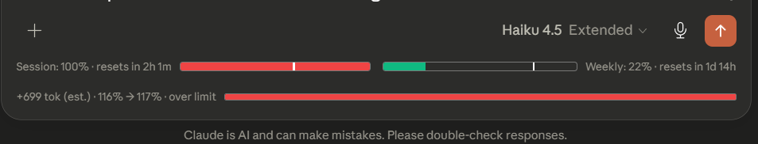
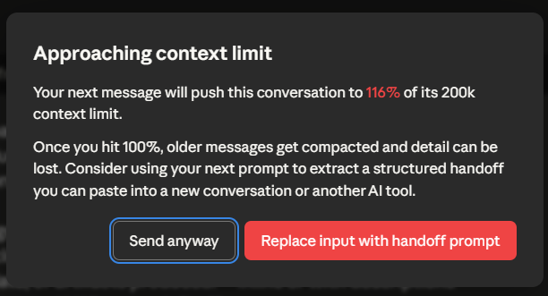

# Claude Token Counter

A browser extension for [claude.ai](https://claude.ai) that turns Claude's session and weekly usage bars into a traffic-light warning system, and pops a Claude-style handoff dialog before you accidentally exhaust your quota.

> **Forked from [she-llac/claude-counter](https://github.com/she-llac/claude-counter)** (MIT). All upstream features (header token count, cache timer, session + weekly usage bars) are preserved. This fork adds the warning system and the handoff modal described below.



## What this fork adds

| Feature | Where you see it |
|---|---|
| **Traffic-light color system** — green (<50%), yellow (50–70%), red (≥70%) | On the main context bar, session bar, and weekly bar |
| **Session / weekly handoff modal** — Claude-style popup that fires when your **5-hour session crosses 60%** OR **7-day weekly crosses 80%** | Two CTAs: dismiss, or inject a structured 5-point handoff prompt into the chat input so your next message becomes a portable memory summary |
| **Persistent dismissal** — dismiss the modal once and it stays dismissed across page refreshes and browser restarts, until the window resets and you cross the threshold in the new window | Behind the scenes via `chrome.storage.local` |

## Screenshots

> The screenshots below are from an earlier development build (v0.5.0). The visible structures (session/weekly bars, modal layout, CTAs) are still current in v0.6.0, but **specific copy** in the modal and a now-removed pre-send preview row visible in the first shot are not in the current build. See [DESIGN.md](./DESIGN.md) for what changed.

### Traffic-light usage bars


Session bar (5-hour window) in red at 100%, weekly (7-day) in green at 22% — both showing the green/yellow/red tier colors. The mini header bar at the top of the chat adopts the same color scheme.

*(The third row in this screenshot — `+699 tok (est.) · 116% → 117% · over limit` — was a pre-send token preview that has since been removed. Only the two usage bars above it are current.)*

### Handoff modal



The modal opens once per reset window when session or weekly quota crosses its threshold. Two CTAs:

- **Send anyway** — closes the dialog, you continue normally
- **Insert handoff prompt** *(or "Replace input with handoff prompt" if you've already typed something)* — injects a structured 5-point memory-extraction template into Claude.ai's input box. Your next message becomes a portable summary you can paste into a new conversation or another AI tool.

Uses `document.execCommand('insertText')` so ProseMirror's editor state updates properly and the send button stays enabled.

*(The title and percentage shown in this earlier screenshot were context-based. The current v0.6.0 modal uses session/weekly trigger text instead — see [DESIGN.md](./DESIGN.md#why-the-modal-moved-from-context--to-session--weekly-) for the rationale.)*

## Installation

This fork isn't on the Chrome Web Store. Install via one of two paths:

### Option 1 — Download zip (easiest)

1. Download the release zip:
   [`claude-token-counter-v0.6.0.zip`](https://github.com/FarGin13/claude_token_counter/releases/latest)
   *(Use the release asset zip, **not** GitHub's auto-generated "Source code (zip)" — the auto zip has a wrapper folder that Chrome can't load.)*
2. Extract the zip anywhere
3. Open `chrome://extensions`
4. Enable **Developer mode** (top-right toggle)
5. Click **Load unpacked**
6. Pick the extracted folder
7. Open https://claude.ai — extension is active

To update later: download the newer zip, remove the old folder from `chrome://extensions`, and load the new one.

### Option 2 — Clone with git (for developers who want easy updates)

```bash
git clone https://github.com/FarGin13/claude_token_counter.git
```

Then steps 3–7 above, picking the cloned folder.

To update: `git pull` inside the folder, then click the 🔄 refresh icon on the extension card in `chrome://extensions`.

## Honest limitations

This is a hobby fork. Real things you should know before relying on it:

- **Header token count is approximate.** The "~26,000 tokens" display in the chat header uses OpenAI's `o200k_base` tokenizer because Claude's real tokenizer isn't public. Expect ±5–15% deviation. The `~` prefix is the honesty label.
- **The modal trigger uses claude.ai's quota numbers directly**, so unlike the header token count it's NOT subject to tokenizer error. When the modal fires at session 60%, that's claude.ai's own measurement, not an estimate.
- **The extension depends on private claude.ai endpoints.** Anthropic hasn't documented these and can change them at any time. When that happens, the extension breaks until selectors get updated.
- **No automatic updates.** You're running a `git pull` or zip-download workflow, not a store-managed extension.
- **Tested only on Chrome MV3.** Firefox and Edge should work (same MV3 manifest) but aren't actively tested.

## How it works

1. A content script wraps `window.fetch` to intercept claude.ai's API responses (this part is upstream's architecture, untouched).
2. Conversation data flows through `tokens.js`, which counts header tokens via the bundled o200k tokenizer.
3. `ui.js` renders the header + session/weekly usage bars (this fork extends them with green/yellow/red tier colors).
4. `main.js` checks session and weekly utilization on every usage update and asks `modal.js` to show the handoff dialog when either crosses its threshold.
5. `modal.js` persists which reset windows have been shown via `chrome.storage.local`, so dismissal sticks across page refreshes.

For deeper architecture notes, see [DESIGN.md](./DESIGN.md).

## Privacy

- All processing happens locally in your browser.
- The extension reads your existing `lastActiveOrg` cookie to query claude.ai's `/usage` endpoint — same authentication claude.ai itself uses.
- No data is sent to any external server.
- No tracking, no telemetry.
- One permission is declared: **`storage`** — used to remember which session/weekly windows you've already dismissed the handoff modal for, so it doesn't re-pop after every page refresh. The data stays in your browser; nothing is sent anywhere. Uninstall the extension to clear it.

## Credits

- Upstream extension: [she-llac/claude-counter](https://github.com/she-llac/claude-counter) — the entire base architecture, token counting, cache timer, and usage bars are theirs.
- Tokenizer: [gpt-tokenizer](https://github.com/niieani/gpt-tokenizer) (MIT, bundled in `src/vendor/o200k_base.js`).
- Inspired by [Claude Usage Tracker](https://github.com/lugia19/Claude-Usage-Extension) by lugia19.

## License

MIT — same as upstream. See [LICENSE](./LICENSE).
